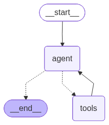

# Deep Research Agent

<div align="center">
    <a href="https://your-domain.streamlit.app">
        
    </a>
</div>

An autonomous AI agent that performs deep web research, reasoning, and reporting. Built with **Gemini 2.5**, **LangGraph**, and **Streamlit**.



## 🚀 Features
- **Cyclic Agentic Workflow:** Uses LangGraph to create a loop of Reasoning → Acting → Observing.
- **Deep Web Search:** Integrated with Tavily API for real-time, cited information retrieval.
- **Long-term Memory:** Maintains conversational context across multiple turns using persistence.
- **Visual Interface:** Clean, interactive frontend built with Streamlit.
- **Professional UI:** Displays "Thinking..." steps and rich markdown responses.

## 🛠️ Tech Stack
- **Brain:** Google Gemini 2.5 Flash
- **Orchestration:** LangGraph (State Machines)
- **Tools:** Tavily Search API
- **Frontend:** Streamlit
- **Language:** Python 3.10+

## ⚙️ Setup & Run

1. **Clone the repository**
   ```bash
   

    ```

2. **Install dependencies**
```bash
pip install -r requirements.txt

```


3. **Configure API Keys**
Create a `.env` file in the root directory and add your keys (never share this file):
```env
GOOGLE_API_KEY=your_gemini_key_here
TAVILY_API_KEY=your_tavily_key_here

```


4. **Run the App**
```bash
streamlit run app.py

```


## 🧠 Architecture

The agent follows a **ReAct** (Reason + Act) pattern:

1. **Input:** User asks a question (e.g., "What is the stock price of Apple?").
2. **Decision:** The Agent (Gemini) decides if it needs external information.
3. **Action:** If yes, it queries the Tavily Search API.
4. **Observation:** It reads the search results.
5. **Loop:** It determines if it has enough info to answer or needs to search again.
6. **Output:** Final synthesized answer delivered to the Streamlit UI.

